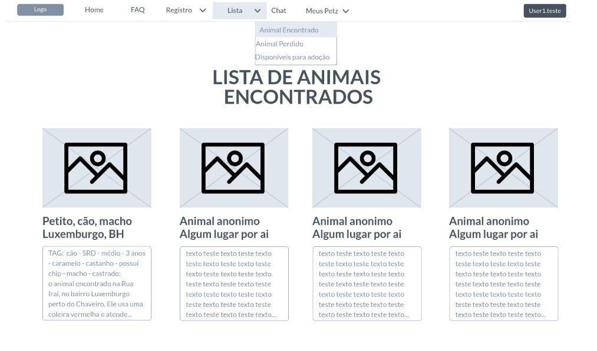

# Projeto de Interface

Dentre as preocupações para a montagem da interface do sistema, estamos estabelecendo foco em questões como agilidade, acessibilidade e usabilidade. Desta forma, o projeto tem uma identidade visual padronizada em todas as telas que são projetadas para funcionamento em plataforma web.

## User Flow

O fluxograma apresentado na figura acima mostra as possíveis interações do usuário pelas telas do sistema. Cada uma das telas deste fluxo é detalhada na seção de Wireframes que se segue. Para visualizar o wireframe completo, acesse o ambiente MarvelApp do projeto.

## Wireframes

#1 Menu   
    Conforme o fluxograma apresentado no item anterior, as telas do projeto serão apresentadas com detalhamento maior a seguir. Nas figuras abaixo, demonstra-se o menu superior exibido após o login do usuário.   

#2 Página Inicial   
    A página inicial mostra um vídeo curto sobre o projeto e um banner com encontros já proporcionados pelo programa.  A barra superior traz elementos distintos:   

-	LOGO: Imagem da logo do projeto;   
-	HOME: Volta para página inicial;   
-	FAQ: Seção na página inicial onde pode-se encontrar perguntas e respostas feitas com frequência pelo público, que pode sanar dúvidas de novos usuários sobre o sistema, conforme apresentado na figura abaixo;   
-	LOGIN: O público é capaz de realizar seu login através de e-mail e senha para que possa acessar as demais páginas;   
-	CADASTRE-SE: Esse componente permite realizar um cadastro através de um email e senha onde o público poderá cadastrar os devidos pets, bem como procurar por animais perdidos e buscar um para adoção.   

#3 Login   
    A página de login é onde o usuário insere suas informações de login, sendo elas e-mail e senha, para acessar sua conta no site conforme exibido na figura abaixo.    

#4 Cadastro     
 	A página de cadastro serve para que os usuários criem uma conta personalizada no sistema. Ela é composta por campos de entrada de texto para informações pessoais sendo elas nome completo, e-mail, telefone, com validação de entrada para garantir a precisão dos dados, conforme figura a seguir.   

   

    Após preencher os campos da primeira parte, o usuário pode clicar em um botão de avanço para seguir para a segunda etapa onde iŕa preencher os campos relacionados ao endereço completo do usuário, rua, número, complemento (preenchimento opcional), bairro, cidade, estado e CEP conforme a figura abaixo.    

   

5 Meus Petz     
    A página Meus Petz, é onde fica reunida as informações de todos os animais cadastrados pelo usuário, dando acesso também a um novo registro de animal conforme demonstrado na figura a seguir.    
    Essa página também dá acesso ao usuário, aos animais semelhantes ao divulgado por ela, assim que ela passa o mouse em cima do animal registrado, abre um leque de informações sobre o mesmo e o botão “Animais Semelhantes Cadastrados”.    

#6 Ache seu PET     
    A página Ache seu PET, é o principal objetivo do sistema onde o usuário irá comparar seu animal com outros animais registrados no sistema que possuem características semelhantes ao seu. Esses animais são selecionados de acordo com as TAGS cadastradas pelo usuário assim que ele registra o mesmo na plataforma.   

   

#7 Registro     
    O comando "registro" permite que os usuários cadastrem no sistema, animais perdidos ou encontrados, fornecendo informações importantes como espécie, raça, porte e idade, conforme mostrado a seguir.   

   

    Além disso, na figura abaixo, é possível descrever o fenótipo do animal e na seguinte, os usuários podem adicionar um pequeno texto com outras características relevantes do animal.   
    
   
   
    
    Por fim, na próxima imagem, é possível incluir uma foto do animal, que ajudará a tornar o perfil do pet mais completo e atrativo para possíveis interessados na adoção ou na busca por animais perdidos.  

   

#8 Listas    
 	Na figura subsequente, temos um exemplo da página de lista, sejam animais encontrados, perdidos ou disponíveis para adoção, esses geralmente são registrados como encontrados e após um tempo, caso não seja reconhecido por seu dono, entra na lista de adoção.   

#9 Páginas dos animais     
	Na página demonstrada a seguir, temos um modelo da página do animal quando selecionado. Nela é possível visualizar informações sobre o animal como nome, foto, tags e outras descrições registradas, e entrar em contato com o responsável pelo anúncio.   

