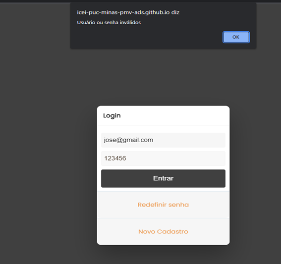
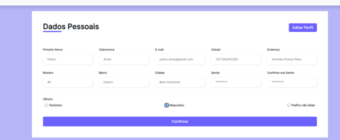
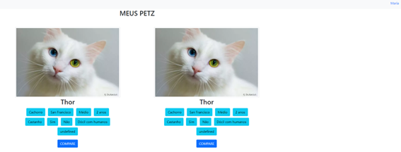
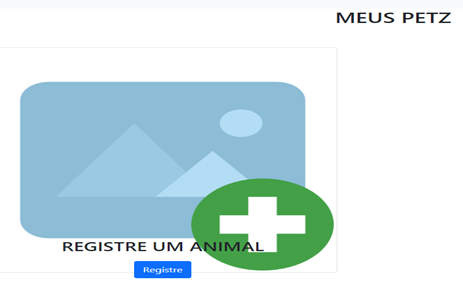
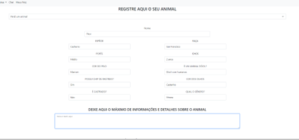

# Registro de Testes de Software

Pré-requisitos: <a href="3-Projeto de Interface.md"> Projeto de Interface</a>, <a href="8-Plano de Testes de Software.md"> Plano de Testes de Software</a>

Relatório com as evidências dos testes de software realizados no sistema pela equipe, baseado em um plano de testes pré-definido.

## RF 001- O sistema deve restringir o acesso a usuários cadastrados para controle e segurança.

## RF-002: O sistema deve permitir que novos usuários se cadastrem na plataforma.

## RF-003: O sistema deve permitir ao usuário cadastrar um animal de estimação vinculado ao próprio usuário - Registro de pet.

## RF-004: O sistema deve permitir o usuário criar um anúncio de desaparecimento de animal de estimação - Reporte de desaparecimento

## Avaliação

Discorra sobre os resultados do teste. Ressaltando pontos fortes e fracos identificados na solução. Comente como o grupo pretende atacar esses pontos nas próximas iterações. Apresente as falhas detectadas e as melhorias geradas a partir dos resultados obtidos nos testes.

> **Links Úteis**:
> - [Ferramentas de Test para Java Script](https://geekflare.com/javascript-unit-testing/)
